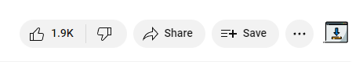

# yt2mp3app Chrome Extension

[Youtube to MP3 Downloader](https://github.com/fajicbenjamin/youtube-to-mp3-downloader) provides `yt2mp3app://` protocol which allows third-party applications to invoke it from outside and send URL parameter while doing it, so it will start application with that URL pre-filled.

This extension leverages that protocol; it renders download button on YouTube video page, which when clicked uses mentioned protocol to start the application with URL from current video.

## Installation

This extension isn't yet published in Google Chrome Store and at the moment is only available through loading it as unpacked extension. First download this repository and then consult [Chrome's documentation](https://developer.chrome.com/docs/extensions/mv3/getstarted/development-basics/#load-unpacked) on loading unpacked extension
